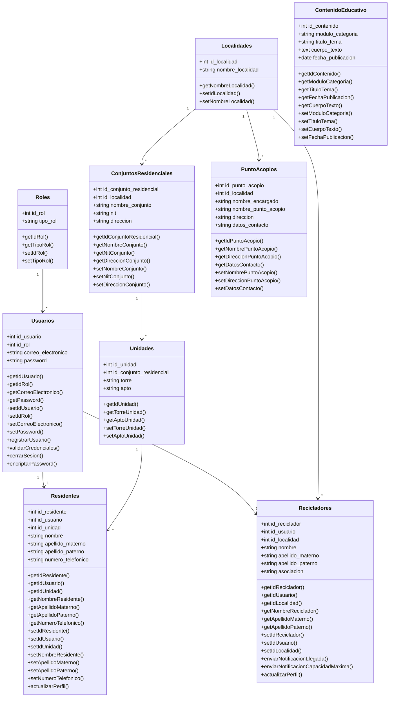

# 📘 Diagrama de Clases - VerdeApp

## Descripción General

Este documento describe la estructura de clases del sistema **VerdeApp**, identificando atributos, métodos y relaciones entre las entidades principales del dominio.

---

# 📊 Diagrama de Clases

---

# 📋 Descripción de Clases

## Roles

Representa los tipos de usuario disponibles en la plataforma.

### Responsabilidades

* Identificar permisos del usuario.
* Clasificar usuarios según su función dentro del sistema.

---

## Usuarios

Gestiona la autenticación y acceso a la plataforma.

### Responsabilidades

* Registro de usuarios.
* Inicio de sesión.
* Validación de credenciales.
* Cierre de sesión.
* Gestión de contraseñas.

---

## Residentes

Representa los habitantes de los conjuntos residenciales.

### Responsabilidades

* Consultar información del sistema.
* Reportar novedades.
* Actualizar datos personales.

---

## Recicladores

Representa los recicladores vinculados al sistema.

### Responsabilidades

* Recibir alertas.
* Notificar llegada a conjuntos.
* Gestionar su perfil.

---

## Localidades

Representa las localidades registradas en el sistema.

### Responsabilidades

* Organizar geográficamente conjuntos residenciales.
* Organizar puntos de acopio.
* Asociar recicladores a una zona determinada.

---

## ConjuntosResidenciales

Representa los conjuntos registrados en la plataforma.

### Responsabilidades

* Agrupar unidades residenciales.
* Mantener información institucional.

---

## Unidades

Representa apartamentos o unidades habitacionales.

### Responsabilidades

* Asociar residentes a un conjunto residencial.

---

## PuntoAcopios

Representa los puntos autorizados para entrega de material reciclable.

### Responsabilidades

* Registrar ubicación.
* Registrar encargado.
* Mantener datos de contacto.

---

## ContenidoEducativo

Representa los módulos educativos publicados en la plataforma.

### Responsabilidades

* Gestionar contenido informativo.
* Almacenar publicaciones educativas.

---

# 🔗 Relaciones Entre Clases

| Clase Origen           | Clase Destino          | Relación |
| ---------------------- | ---------------------- | -------- |
| Roles                  | Usuarios               | 1 : N    |
| Usuarios               | Residentes             | 1 : 1    |
| Usuarios               | Recicladores           | 1 : 1    |
| Localidades            | ConjuntosResidenciales | 1 : N    |
| Localidades            | PuntoAcopios           | 1 : N    |
| Localidades            | Recicladores           | 1 : N    |
| ConjuntosResidenciales | Unidades               | 1 : N    |
| Unidades               | Residentes             | 1 : N    |

---

# 📌 Observaciones

* El modelo sigue una estructura orientada a objetos alineada con la base de datos del proyecto.
* La clase `Usuarios` centraliza los procesos de autenticación.
* Las clases `Residentes` y `Recicladores` representan perfiles especializados asociados a un usuario.
* La clase `ContenidoEducativo` funciona como entidad independiente para la gestión de publicaciones.
* Las relaciones mantienen coherencia con el modelo entidad-relación definido para VerdeApp.
