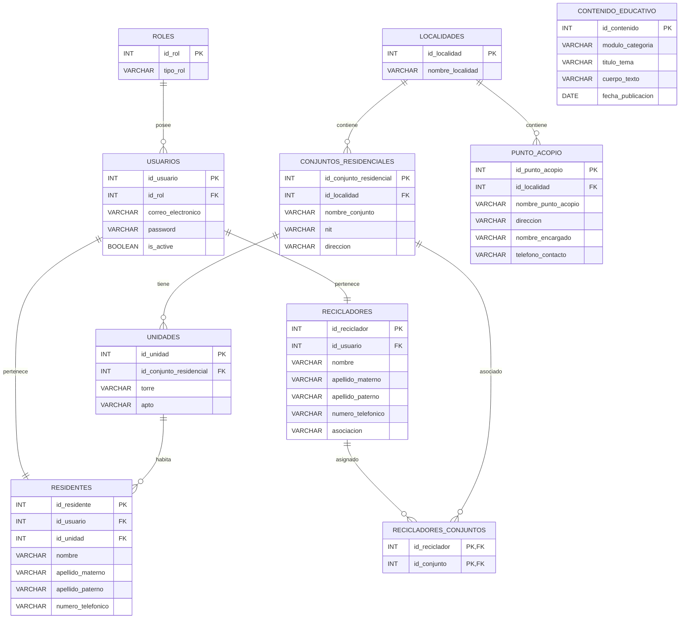

# Sistema de Gestión de Reciclaje para Conjuntos Residenciales


El sistema permite:

* Administrar usuarios y roles.
* Gestionar residentes.
* Gestionar recicladores asociados.
* Registrar conjuntos residenciales y sus unidades.
* Administrar puntos de acopio.
* Publicar contenido educativo sobre reciclaje.

---

# Tecnologías Utilizadas

| Categoría            | Tecnología   |
| -------------------- | ------------ |
| Frontend             | React        |
| Lenguaje Frontend    | TypeScript   |
| Build Tool           | Vite         |
| Estilos              | Tailwind CSS |
| Backend              | FastAPI      |
| Lenguaje Backend     | Python       |
| Base de Datos        | PostgreSQL   |
| Control de Versiones | Git          |
| Repositorio          | GitHub       |

---

# Modelo Entidad Relación



---

# Arquitectura General

```text
ROLES
   │
   ▼
USUARIOS
   │
   ├── RESIDENTES
   │
   └── RECICLADORES

LOCALIDADES
   │
   ├── CONJUNTOS_RESIDENCIALES
   │          │
   │          ▼
   │      UNIDADES
   │          │
   │          ▼
   │     RESIDENTES
   │
   └── PUNTO_ACOPIO

RECICLADORES
      ▲
      │
      ▼
RECICLADORES_CONJUNTOS
      ▲
      │
      ▼
CONJUNTOS_RESIDENCIALES

CONTENIDO_EDUCATIVO
```

---

# Diccionario de Datos

## roles

| Campo    | Tipo    |
| -------- | ------- |
| id_rol   | INT     |
| tipo_rol | VARCHAR |

---

## usuarios

| Campo              | Tipo    |
| ------------------ | ------- |
| id_usuario         | INT     |
| id_rol             | INT     |
| correo_electronico | VARCHAR |
| password           | VARCHAR |
| is_active          | BOOLEAN |

---

## residentes

| Campo             | Tipo    |
| ----------------- | ------- |
| id_residente      | INT     |
| id_usuario        | INT     |
| id_unidad         | INT     |
| nombre            | VARCHAR |
| apellido_materno  | VARCHAR |
| apellido_paterno  | VARCHAR |
| numero_telefonico | VARCHAR |

---

## recicladores

| Campo             | Tipo    |
| ----------------- | ------- |
| id_reciclador     | INT     |
| id_usuario        | INT     |
| nombre            | VARCHAR |
| apellido_materno  | VARCHAR |
| apellido_paterno  | VARCHAR |
| numero_telefonico | VARCHAR |
| asociacion        | VARCHAR |

---

## localidades

| Campo            | Tipo    |
| ---------------- | ------- |
| id_localidad     | INT     |
| nombre_localidad | VARCHAR |

---

## conjuntos_residenciales

| Campo                   | Tipo    |
| ----------------------- | ------- |
| id_conjunto_residencial | INT     |
| id_localidad            | INT     |
| nombre_conjunto         | VARCHAR |
| nit                     | VARCHAR |
| direccion               | VARCHAR |

---

## unidades

| Campo                   | Tipo    |
| ----------------------- | ------- |
| id_unidad               | INT     |
| id_conjunto_residencial | INT     |
| torre                   | VARCHAR |
| apto                    | VARCHAR |

---

## punto_acopio

| Campo               | Tipo    |
| ------------------- | ------- |
| id_punto_acopio     | INT     |
| id_localidad        | INT     |
| nombre_punto_acopio | VARCHAR |
| direccion           | VARCHAR |
| nombre_encargado    | VARCHAR |
| telefono_contacto   | VARCHAR |

---

## contenido_educativo

| Campo             | Tipo    |
| ----------------- | ------- |
| id_contenido      | INT     |
| modulo_categoria  | VARCHAR |
| titulo_tema       | VARCHAR |
| cuerpo_texto      | VARCHAR |
| fecha_publicacion | DATE    |

---

## recicladores_conjuntos

| Campo         | Tipo |
| ------------- | ---- |
| id_reciclador | INT  |
| id_conjunto   | INT  |

**Clave primaria compuesta:**

```sql
PRIMARY KEY (id_reciclador, id_conjunto)
```

---

# Relaciones

| Entidad A               | Entidad B               | Cardinalidad |
| ----------------------- | ----------------------- | ------------ |
| Roles                   | Usuarios                | 1:N          |
| Usuarios                | Residentes              | 1:1          |
| Usuarios                | Recicladores            | 1:1          |
| Localidades             | Conjuntos Residenciales | 1:N          |
| Localidades             | Puntos de Acopio        | 1:N          |
| Conjuntos Residenciales | Unidades                | 1:N          |
| Unidades                | Residentes              | 1:N          |
| Recicladores            | Conjuntos Residenciales | N:M          |

---

# Reglas de Negocio

* Todo usuario debe tener un rol asignado.
* Un residente pertenece a una única unidad residencial.
* Un conjunto residencial puede contener múltiples unidades.
* Una localidad puede contener múltiples conjuntos residenciales.
* Una localidad puede contener múltiples puntos de acopio.
* Un reciclador puede estar asociado a varios conjuntos residenciales.
* Un conjunto residencial puede trabajar con varios recicladores.
* El contenido educativo puede ser consultado por los usuarios del sistema.

```
```
