# Casos de Uso - VerdeApp

## Descripción General

Este documento describe los casos de uso identificados para la plataforma **VerdeApp**, orientada a la gestión de reciclaje en conjuntos residenciales.

---

# Actores

## Residente

Usuario principal de la plataforma encargado de:

* Registrarse en el sistema.
* Consultar información educativa.
* Consultar recicladores y puntos de acopio (directorio).
* Reportar niveles de capacidad SHUT (notificación).
* Gestionar su perfil(editarlo).

---

## Reciclador

Usuario encargado de:

* Consultar alertas de residuos.
* Gestionar información relacionada con los conjuntos asignados.
* Actualizar información de perfil.
* Comunicar llegada al conjunto.
* Reportar niveles de capacidad SHUT (notificación).

---

## Admin_sistema

Usuario responsable de:

* Administrar el contenido educativo.
* Gestionar directorios de recicladores y puntos de acopio.
* Supervisar el funcionamiento general del sistema.

---

## Admin_conjunto

Usuario responsable de la gestión de uno o más conjuntos residenciales:

* Registrarse en el sistema.
* Consultar y administrar los conjuntos que gestiona.
* Invitar recicladores autorizados a sus conjuntos.
* Gestionar su perfil.
* Cerrar sesión.

---

# 📋 Catálogo de Casos de Uso

| Código | Caso de Uso                                              | Actor(es)                            |
| ------ | -------------------------------------------------------- | ------------------------------------ |
| RQF001 | Validar Usuario                                          | Residente, Reciclador, Admin_sistema |
| RQF002 | Registrar usuarios                                       | Residente, Reciclador                |
| RQF003 | Alertar máxima capacidad SHUT                            | Residente, Reciclador                |
| RQF004 | Visualizar catálogo educativo                            | Residente                            |
| RQF005 | Visualizar directorio de recicladores y puntos de acopio | Residente                            |
| RQF006 | Notificar llegada al conjunto residencial                | Reciclador                           |
| RQF007 | Cerrar sesión                                            | Residente, Reciclador, Admin_sistema, Admin_conjunto |
| RQF008 | Actualizar perfil                                        | Residente, Reciclador, Admin_conjunto |
| RQF009 | Visualizar gestión de residuos del conjunto              | Residente, Reciclador                |
| RQF010 | Gestionar contenido educativo                            | Admin_sistema                        |
| RQF011 | Gestionar directorio de puntos de acopio y recicladores  | Admin_sistema                        |

---

# 🧩 Diagrama General de Casos de Uso

```mermaid
flowchart TB

    Residente([Residente])
    Reciclador([Reciclador])
    Admin([Admin_sistema])
    AdminConjunto([Admin_conjunto])

    RQF001([RQF001\nValidar Usuario])
    RQF002([RQF002\nRegistrar Usuarios])
    RQF003([RQF003\nAlertar máxima capacidad SHUT])
    RQF004([RQF004\nVisualizar Catálogo Educativo])
    RQF005([RQF005\nVisualizar Directorio])
    RQF006([RQF006\nNotificar llegada al conjunto])
    RQF007([RQF007\nCerrar Sesión])
    RQF008([RQF008\nActualizar Perfil])
    RQF009([RQF009\nVisualizar Gestión de Residuos])
    RQF010([RQF010\nGestionar Contenido Educativo])
    RQF011([RQF011\nGestionar Directorio])

    Residente --> RQF001
    Residente --> RQF002
    Residente --> RQF003
    Residente --> RQF004
    Residente --> RQF005
    Residente --> RQF007
    Residente --> RQF008
    Residente --> RQF009

    Reciclador --> RQF001
    Reciclador --> RQF002
    Reciclador --> RQF003
    Reciclador --> RQF006
    Reciclador --> RQF007
    Reciclador --> RQF008
    Reciclador --> RQF009

    Admin --> RQF001
    Admin --> RQF007
    Admin --> RQF010
    Admin --> RQF011

    AdminConjunto --> RQF001
    AdminConjunto --> RQF002
    AdminConjunto --> RQF007
    AdminConjunto --> RQF008
```



---

# 📖 Especificación de Casos de Uso

---

## RQF001 - Validar Usuario

### Actores

* Residente
* Reciclador
* Admin_sistema

### Descripción

Permite autenticar un usuario mediante sus credenciales de acceso.

### Flujo Principal

1. El usuario ingresa correo electrónico.
2. El usuario ingresa contraseña.
3. El sistema valida las credenciales.
4. El sistema concede acceso.

### Flujo Alternativo

* Si las credenciales son incorrectas, el sistema muestra un mensaje de error.

---

## RQF002 - Registrar Usuarios

### Actores

* Residente
* Reciclador

### Descripción

Permite crear una nueva cuenta dentro del sistema.

### Flujo Principal

1. El usuario diligencia el formulario.
2. El sistema valida la información.
3. El sistema registra la cuenta.
4. Se envía un correo electrónico de validación.

---

## RQF003 - Alertar Máxima Capacidad SHUT

### Actores

* Residente
* Reciclador

### Descripción

Permite reportar que el SHUT ha alcanzado su capacidad máxima.

### Flujo Principal

1. El usuario genera la alerta.
2. El sistema registra la novedad.
3. El sistema notifica a los responsables correspondientes.

---

## RQF004 - Visualizar Catálogo Educativo

### Actor

* Residente

### Descripción

Permite consultar contenido educativo relacionado con reciclaje y separación de residuos.

---

## RQF005 - Visualizar Directorio de Recicladores y Puntos de Acopio

### Actor

* Residente

### Descripción

Permite consultar el listado de recicladores y puntos de acopio registrados.

---

## RQF006 - Notificar Llegada al Conjunto Residencial

### Actor

* Reciclador

### Descripción

Permite informar que el reciclador ha llegado al conjunto residencial para realizar la recolección.

---

## RQF007 - Cerrar Sesión

### Actores

* Residente
* Reciclador
* Admin_sistema

### Descripción

Permite finalizar la sesión activa del usuario.

---

## RQF008 - Actualizar Perfil

### Actores

* Residente
* Reciclador

### Descripción

Permite modificar la información personal registrada en el sistema.

---

## RQF009 - Visualizar Gestión de Residuos del Conjunto

### Actores

* Residente
* Reciclador

### Descripción

Permite consultar información relacionada con la gestión de residuos dentro del conjunto residencial.

---

## RQF010 - Gestionar Contenido Educativo

### Actor

* Admin_sistema

### Descripción

Permite administrar el contenido educativo de la plataforma.

### Funciones

* Crear contenido.
* Editar contenido.
* Eliminar contenido.
* Publicar contenido.

---

## RQF011 - Gestionar Directorio de Puntos de Acopio y Recicladores

### Actor

* Admin_sistema

### Descripción

Permite administrar el directorio de recicladores y puntos de acopio registrados.

### Funciones

* Crear registros.
* Editar registros.
* Eliminar registros.
* Consultar registros.

```
```
