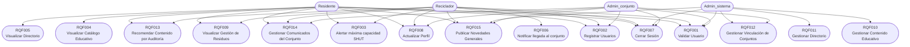

# Casos de Uso - VerdeApp

## Descripción General

Este documento describe los casos de uso identificados para la plataforma **VerdeApp**, orientada a la gestión de reciclaje en conjuntos residenciales.

---

# Actores

## Residente

Usuario principal de la plataforma encargado de:

* Registrarse en el sistema.
* Consultar información educativa.
* Consultar recicladores y puntos de acopio (directorio).
* Reportar niveles de capacidad SHUT (notificación).
* Gestionar su perfil(editarlo).

---

## Reciclador

Usuario encargado de:

* Consultar alertas de residuos.
* Gestionar información relacionada con los conjuntos asignados.
* Actualizar información de perfil.
* Comunicar llegada al conjunto.
* Reportar niveles de capacidad SHUT (notificación).

---

## Admin_sistema

Usuario responsable de:

* Administrar el contenido educativo.
* Gestionar directorios de recicladores y puntos de acopio.
* Supervisar el funcionamiento general del sistema.

---

## Admin_conjunto

Usuario responsable de la gestión de uno o más conjuntos residenciales:

* Registrarse en el sistema.
* Consultar y administrar los conjuntos que gestiona.
* Invitar recicladores autorizados a sus conjuntos.
* Gestionar su perfil.
* Cerrar sesión.

---

# 📋 Catálogo de Casos de Uso

| Código | Caso de Uso                                              | Actor(es)                            |
| ------ | -------------------------------------------------------- | ------------------------------------ |
| RQF001 | Validar Usuario                                          | Residente, Reciclador, Admin_sistema |
| RQF002 | Registrar usuarios                                       | Residente, Reciclador                |
| RQF003 | Alertar máxima capacidad SHUT                            | Residente, Reciclador                |
| RQF004 | Visualizar catálogo educativo                            | Residente                            |
| RQF005 | Visualizar directorio de recicladores y puntos de acopio | Residente                            |
| RQF006 | Notificar llegada al conjunto residencial                | Reciclador                           |
| RQF007 | Cerrar sesión                                            | Residente, Reciclador, Admin_sistema, Admin_conjunto |
| RQF008 | Actualizar perfil                                        | Residente, Reciclador, Admin_conjunto |
| RQF009 | Visualizar gestión de residuos del conjunto              | Residente, Reciclador                |
| RQF010 | Gestionar contenido educativo                            | Admin_sistema                        |
| RQF011 | Gestionar directorio de puntos de acopio y recicladores  | Admin_sistema                        |
| RQF012 | Gestionar vinculación de conjuntos                       | Admin_conjunto, Admin_sistema         |
| RQF013 | Recomendar contenido educativo por auditoría             | Reciclador (dispara), Residente (recibe) |
| RQF014 | Gestionar comunicados del conjunto                       | Admin_conjunto, Residente, Reciclador |
| RQF015 | Publicar novedades generales                             | Admin_sistema, Residente, Reciclador, Admin_conjunto |

---

# 🧩 Diagrama General de Casos de Uso

```mermaid
flowchart TB

    Residente([Residente])
    Reciclador([Reciclador])
    Admin([Admin_sistema])
    AdminConjunto([Admin_conjunto])

    RQF001([RQF001\nValidar Usuario])
    RQF002([RQF002\nRegistrar Usuarios])
    RQF003([RQF003\nAlertar máxima capacidad SHUT])
    RQF004([RQF004\nVisualizar Catálogo Educativo])
    RQF005([RQF005\nVisualizar Directorio])
    RQF006([RQF006\nNotificar llegada al conjunto])
    RQF007([RQF007\nCerrar Sesión])
    RQF008([RQF008\nActualizar Perfil])
    RQF009([RQF009\nVisualizar Gestión de Residuos])
    RQF010([RQF010\nGestionar Contenido Educativo])
    RQF011([RQF011\nGestionar Directorio])
    RQF012([RQF012\nGestionar Vinculación de Conjuntos])
    RQF013([RQF013\nRecomendar Contenido por Auditoría])
    RQF014([RQF014\nGestionar Comunicados del Conjunto])
    RQF015([RQF015\nPublicar Novedades Generales])

    Residente --> RQF001
    Residente --> RQF002
    Residente --> RQF003
    Residente --> RQF004
    Residente --> RQF005
    Residente --> RQF007
    Residente --> RQF008
    Residente --> RQF009
    Residente --> RQF013
    Residente --> RQF014
    Residente --> RQF015

    Reciclador --> RQF001
    Reciclador --> RQF002
    Reciclador --> RQF003
    Reciclador --> RQF006
    Reciclador --> RQF007
    Reciclador --> RQF008
    Reciclador --> RQF009
    Reciclador --> RQF013
    Reciclador --> RQF014
    Reciclador --> RQF015

    Admin --> RQF001
    Admin --> RQF007
    Admin --> RQF010
    Admin --> RQF011
    Admin --> RQF012
    Admin --> RQF015

    AdminConjunto --> RQF001
    AdminConjunto --> RQF002
    AdminConjunto --> RQF007
    AdminConjunto --> RQF008
    AdminConjunto --> RQF012
    AdminConjunto --> RQF014
    AdminConjunto --> RQF015
```

---

# 📖 Especificación de Casos de Uso

---

## RQF001 - Validar Usuario

### Actores

* Residente
* Reciclador
* Admin_sistema

### Descripción

Permite autenticar un usuario mediante sus credenciales de acceso.

### Flujo Principal

1. El usuario ingresa correo electrónico.
2. El usuario ingresa contraseña.
3. El sistema valida las credenciales.
4. El sistema concede acceso.

### Flujo Alternativo

* Si las credenciales son incorrectas, el sistema muestra un mensaje de error.

---

## RQF002 - Registrar Usuarios

### Actores

* Residente
* Reciclador

### Descripción

Permite crear una nueva cuenta dentro del sistema.

### Flujo Principal

1. El usuario diligencia el formulario.
2. El sistema valida la información.
3. El sistema registra la cuenta.
4. Se envía un correo electrónico de validación.

---

## RQF003 - Alertar Máxima Capacidad SHUT

### Actores

* Residente
* Reciclador

### Descripción

Permite reportar que el SHUT ha alcanzado su capacidad máxima.

### Flujo Principal

1. El usuario genera la alerta.
2. El sistema registra la novedad.
3. El sistema notifica a los responsables correspondientes.

---

## RQF004 - Visualizar Catálogo Educativo

### Actor

* Residente

### Descripción

Permite consultar contenido educativo relacionado con reciclaje y separación de residuos.

---

## RQF005 - Visualizar Directorio de Recicladores y Puntos de Acopio

### Actor

* Residente

### Descripción

Permite consultar el listado de recicladores y puntos de acopio registrados.

---

## RQF006 - Notificar Llegada al Conjunto Residencial

### Actor

* Reciclador

### Descripción

Permite informar que el reciclador ha llegado al conjunto residencial para realizar la recolección.

---

## RQF007 - Cerrar Sesión

### Actores

* Residente
* Reciclador
* Admin_sistema

### Descripción

Permite finalizar la sesión activa del usuario.

---

## RQF008 - Actualizar Perfil

### Actores

* Residente
* Reciclador

### Descripción

Permite modificar la información personal registrada en el sistema.

---

## RQF009 - Visualizar Gestión de Residuos del Conjunto

### Actores

* Residente
* Reciclador

### Descripción

Permite consultar información relacionada con la gestión de residuos dentro del conjunto residencial.

---

## RQF010 - Gestionar Contenido Educativo

### Actor

* Admin_sistema

### Descripción

Permite administrar el contenido educativo de la plataforma.

### Funciones

* Crear contenido.
* Editar contenido.
* Eliminar contenido.
* Publicar contenido.

---

## RQF011 - Gestionar Directorio de Puntos de Acopio y Recicladores

### Actor

* Admin_sistema

### Descripción

Permite administrar el directorio de recicladores y puntos de acopio registrados.

### Funciones

* Crear registros.
* Editar registros.
* Eliminar registros.
* Consultar registros.

---

## RQF012 - Gestionar Vinculación de Conjuntos

### Actores

* Admin_conjunto
* Admin_sistema

### Descripción

Permite que un Admin_conjunto solicite desvincularse de un conjunto que ya no administra, y que el Admin_sistema gestione esas solicitudes (aprobar/rechazar) y asigne nuevos conjuntos a administradores existentes. El proceso requiere aprobación humana para evitar que un conjunto quede sin administrador sin aviso previo.

### Flujo Principal

1. El Admin_conjunto selecciona uno de sus conjuntos y envía una solicitud de desvinculación con motivo opcional.
2. La solicitud queda pendiente hasta que el Admin_sistema la gestione.
3. El Admin_sistema aprueba o rechaza la solicitud, o asigna un nuevo conjunto al administrador.
4. El Admin_conjunto recibe notificación del resultado.

---

## RQF013 - Recomendar Contenido Educativo por Auditoría

### Actores

* Reciclador (dispara el evento al calificar)
* Residente (recibe la recomendación)
* Sistema (proceso automático)

### Descripción

Cuando un reciclador registra una calificación de auditoría (RQF-009) con categorías negativas (Separación, Preparación, Presentación o Contaminación), el sistema recomienda automáticamente módulos del contenido educativo (RQF-010) relacionados a los residentes del conjunto auditado.

### Flujo Principal

1. El reciclador guarda la calificación de auditoría del conjunto.
2. El sistema detecta las categorías con resultado negativo.
3. Busca módulos educativos etiquetados con esas categorías.
4. Marca los módulos encontrados como "Recomendados" para los residentes de ese conjunto.

### Flujo Alternativo

* Si no hay módulos disponibles para una categoría fallida, no se genera una recomendación vacía.

---

## RQF014 - Gestionar Comunicados del Conjunto

### Actores

* Admin_conjunto
* Residente
* Reciclador

### Descripción

Permite que el Admin_conjunto publique comunicados (texto, imágenes, video, PDF, documentos de office) dirigidos a los residentes y/o recicladores de su conjunto, con fecha de expiración según el tipo (Informativo, Urgente, Convocatoria, Mantenimiento, Reciclaje).

### Flujo Principal

1. El Admin_conjunto redacta el comunicado y selecciona destinatarios (residentes y/o recicladores) y tipo.
2. Adjunta archivos si aplica.
3. El sistema publica el comunicado en el feed de los destinatarios y les notifica.
4. El comunicado se oculta automáticamente al expirar según su tipo.

### Flujo Alternativo

* El Admin_conjunto puede editar o eliminar un comunicado antes de que expire.

---

## RQF015 - Publicar Novedades Generales

### Actores

* Admin_sistema
* Residente
* Reciclador
* Admin_conjunto

### Descripción

Permite que el Admin_sistema publique novedades de alcance general (no ligadas a un conjunto específico) dirigidas a todos los usuarios o a grupos de roles concretos, con adjuntos y expiración configurable.

### Flujo Principal

1. El Admin_sistema redacta la novedad y elige el alcance (todos, solo residentes, solo recicladores o solo Admin_conjunto).
2. Adjunta archivos o links externos si aplica.
3. El sistema sugiere una fecha de expiración, que el Admin_sistema puede modificar.
4. Los usuarios del alcance seleccionado ven la novedad hasta que expire o sea archivada.

### Flujo Alternativo

* El Admin_sistema puede editar la novedad o archivarla manualmente antes de que expire.

