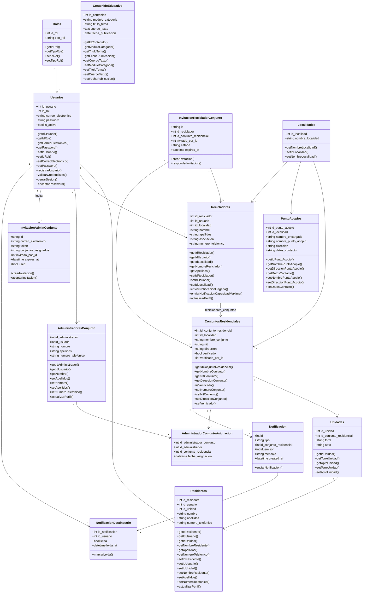

# 📘 Diagrama de Clases - VerdeApp

## Descripción General

Este documento describe la estructura de clases del sistema **VerdeApp**, identificando atributos, métodos y relaciones entre las entidades principales del dominio.

---

# 📊 Diagrama de Clases

---

# 📋 Descripción de Clases

## Roles

Representa los tipos de usuario disponibles en la plataforma.

### Responsabilidades

* Identificar permisos del usuario.
* Clasificar usuarios según su función dentro del sistema.

---

## Usuarios

Gestiona la autenticación y acceso a la plataforma.

### Responsabilidades

* Registro de usuarios.
* Inicio de sesión.
* Validación de credenciales.
* Cierre de sesión.
* Gestión de contraseñas.

---

## Residentes

Representa los habitantes de los conjuntos residenciales.

### Responsabilidades

* Consultar información del sistema.
* Reportar novedades.
* Actualizar datos personales.

---

## Recicladores

Representa los recicladores vinculados al sistema.

### Responsabilidades

* Recibir alertas.
* Notificar llegada a conjuntos.
* Gestionar su perfil.

---

## AdministradoresConjunto

Representa a la persona (natural o de una empresa de administración) que gestiona uno o varios conjuntos residenciales por contrato. A diferencia de Residentes/Recicladores, esta cuenta nunca se crea por registro público: solo un Admin_sistema puede originarla, mediante una invitación (ver `InvitacionAdminConjunto`).

### Responsabilidades

* Administrar los conjuntos que tiene asignados.
* Invitar recicladores a trabajar en sus conjuntos.
* Publicar comunicados dirigidos a sus conjuntos.
* Gestionar su perfil.

---

## AdministradorConjuntoAsignacion

Tabla de asociación con datos propios (`fecha_asignacion`) entre `AdministradoresConjunto` y `ConjuntosResidenciales`: un administrador puede manejar varios conjuntos, y un conjunto puede tener más de un administrador asignado a lo largo del tiempo.

---

## InvitacionAdminConjunto

Representa una invitación que el Admin_sistema envía por correo a una persona para que se convierta en Administrador de Conjunto. Al aceptarla (con un token único, antes de expirar) se crea la cuenta nueva — la contraseña la define únicamente la persona invitada.

---

## InvitacionRecicladorConjunto

Representa la solicitud de autorización que un Admin_conjunto envía a un Reciclador ya existente para que trabaje en su conjunto. A diferencia de la anterior, aquí el reciclador ya tiene cuenta: aceptar solo crea el vínculo en `recicladores_conjuntos`. Puede quedar `PENDIENTE`, `ACEPTADA` o `RECHAZADA`.

---

## Notificacion / NotificacionDestinatario

Representa los avisos del sistema (llegada del reciclador, SHUT lleno/vaciado) enviados a los usuarios de un conjunto. `Notificacion` guarda el evento una sola vez; `NotificacionDestinatario` es la tabla por-usuario que registra si cada destinatario ya la leyó.

---

## Localidades

Representa las localidades registradas en el sistema.

### Responsabilidades

* Organizar geográficamente conjuntos residenciales.
* Organizar puntos de acopio.
* Asociar recicladores a una zona determinada.

---

## ConjuntosResidenciales

Representa los conjuntos registrados en la plataforma.

### Responsabilidades

* Agrupar unidades residenciales.
* Mantener información institucional.

---

## Unidades

Representa apartamentos o unidades habitacionales.

### Responsabilidades

* Asociar residentes a un conjunto residencial.

---

## PuntoAcopios

Representa los puntos autorizados para entrega de material reciclable.

### Responsabilidades

* Registrar ubicación.
* Registrar encargado.
* Mantener datos de contacto.

---

## ContenidoEducativo

Representa los módulos educativos publicados en la plataforma.

### Responsabilidades

* Gestionar contenido informativo.
* Almacenar publicaciones educativas.

---

# 🔗 Relaciones Entre Clases

| Clase Origen               | Clase Destino                    | Relación |
| --------------------------- | --------------------------------- | -------- |
| Roles                       | Usuarios                          | 1 : N    |
| Usuarios                    | Residentes                        | 1 : 1    |
| Usuarios                    | Recicladores                      | 1 : 1    |
| Usuarios                    | AdministradoresConjunto           | 1 : 1    |
| Localidades                 | ConjuntosResidenciales            | 1 : N    |
| Localidades                 | PuntoAcopios                       | 1 : N    |
| Localidades                 | Recicladores                      | 1 : N    |
| ConjuntosResidenciales      | Unidades                          | 1 : N    |
| Unidades                    | Residentes                        | 1 : N    |
| Recicladores                | ConjuntosResidenciales            | N : M (vía `recicladores_conjuntos`) |
| AdministradoresConjunto     | ConjuntosResidenciales            | N : M (vía `AdministradorConjuntoAsignacion`) |
| Usuarios                    | InvitacionAdminConjunto           | 1 : N (invita)|
| Recicladores                | InvitacionRecicladorConjunto      | 1 : N    |
| ConjuntosResidenciales      | InvitacionRecicladorConjunto      | 1 : N    |
| ConjuntosResidenciales      | Notificacion                      | 1 : N    |
| Notificacion                | NotificacionDestinatario          | 1 : N    |
| Usuarios                    | NotificacionDestinatario          | 1 : N    |

---

# 📌 Observaciones

* El modelo sigue una estructura orientada a objetos alineada con la base de datos del proyecto (`be/app/models/`).
* La clase `Usuarios` centraliza los procesos de autenticación.
* Las clases `Residentes`, `Recicladores` y `AdministradoresConjunto` representan perfiles especializados asociados 1:1 a un usuario, uno por cada rol (2, 3 y 4 respectivamente). El rol 1 (Admin_sistema) no tiene una clase de perfil propia: sus datos viven directamente en `Usuarios`.
* `AdministradoresConjunto` nunca se crea por registro público — únicamente mediante `InvitacionAdminConjunto`, aceptada con un token de un solo uso.
* Las relaciones N:M (`Recicladores`↔`ConjuntosResidenciales` y `AdministradoresConjunto`↔`ConjuntosResidenciales`) se muestran aquí como asociaciones directas; sus tablas intermedias (`recicladores_conjuntos`, `administradores_conjuntos`) se detallan como entidades en el diagrama Entidad-Relación.
* La clase `ContenidoEducativo` funciona como entidad independiente para la gestión de publicaciones; en el código actual el modelo ya existe pero todavía no tiene un router que lo exponga (RQF-010 sigue "Por implementar").
* Las relaciones mantienen coherencia con el modelo entidad-relación definido para VerdeApp.
