# 📘 Diagrama de Clases - VerdeApp

## Descripción General

Este documento describe la estructura de clases del sistema **VerdeApp**, identificando atributos, métodos y relaciones entre las entidades principales del dominio.

> **Nota (2026-08-29)**: este diagrama estaba muy desactualizado — le faltaban 7 entidades completas (`AuditoriaConjunto`, `Comunicado`, `Novedad`, `SolicitudDesvinculacion`, `PasswordResetToken`, `EmailVerificationToken`, `TokenRevocado`) y todos los IDs seguían marcados como `int`, cuando el proyecto migró 20 de sus 22 tablas a UUIDv7 (a pedido del profesor, para que las llaves primarias no sean adivinables). Se reconstruyó leyendo directamente `be/app/models/*.py`. También se dejó de listar un getter/setter por cada atributo (ruido que no aporta, y Python no los usa explícitamente) — ahora solo se muestran los métodos de negocio reales.

---

# 📊 Diagrama de Clases

```mermaid
classDiagram

class Role {
    +int id_rol
    +string tipo_rol
}

class Localidad {
    +int id_localidad
    +string nombre_localidad
}

class Usuario {
    +UUID id_usuario
    +int id_rol
    +string correo_electronico
    +string password
    +bool is_active
    +string locale
    +int intentos_fallidos
    +datetime bloqueado_hasta

    +registrarUsuario()
    +validarCredenciales()
    +cerrarSesion()
    +encriptarPassword()
}

class Residente {
    +UUID id_residente
    +UUID id_usuario
    +UUID id_unidad
    +string nombre
    +string apellidos
    +string numero_telefonico

    +actualizarPerfil()
}

class Reciclador {
    +UUID id_reciclador
    +UUID id_usuario
    +int localidad_id
    +string nombre
    +string apellidos
    +string asociacion
    +string numero_telefonico
    +bool mostrar_contacto_directorio

    +enviarNotificacionLlegada()
    +registrarAuditoria()
    +actualizarPerfil()
}

class AdministradorConjunto {
    +UUID id_administrador
    +UUID id_usuario
    +string nombre
    +string apellidos
    +string numero_telefonico

    +invitarReciclador()
    +publicarComunicado()
    +solicitarDesvinculacion()
    +actualizarPerfil()
}

class AdministradorConjuntoAsignacion {
    +UUID id_administrador_conjunto
    +UUID id_administrador
    +UUID id_conjunto_residencial
    +datetime fecha_asignacion
    +datetime fecha_desvinculacion
}

class InvitacionAdminConjunto {
    +UUID id
    +string correo_electronico
    +string token
    +string conjuntos_asignados
    +UUID invitado_por_id
    +datetime expires_at
    +bool used
    +datetime created_at

    +crearInvitacion()
    +aceptarInvitacion()
}

class InvitacionRecicladorConjunto {
    +UUID id
    +UUID id_reciclador
    +UUID id_conjunto_residencial
    +UUID invitado_por_id
    +string estado
    +datetime expires_at
    +datetime created_at

    +crearInvitacion()
    +responderInvitacion()
}

class SolicitudDesvinculacion {
    +UUID id
    +UUID id_administrador
    +UUID id_conjunto_residencial
    +string motivo
    +string estado
    +string motivo_rechazo
    +datetime created_at
    +datetime resuelta_at
    +UUID resuelta_por_id

    +crearSolicitud()
    +aprobar()
    +rechazar()
}

class Comunicado {
    +UUID id_comunicado
    +UUID id_conjunto_residencial
    +UUID id_administrador
    +string destinatarios
    +string tipo
    +string texto
    +string url_adjunto
    +date fecha_evento
    +datetime fecha_expiracion
    +datetime created_at
    +datetime fecha_edicion

    +publicar()
    +editar()
    +eliminar()
}

class Novedad {
    +UUID id_novedad
    +UUID id_admin_sistema
    +string alcance
    +string texto
    +string url_adjunto
    +datetime fecha_expiracion
    +datetime created_at
    +datetime fecha_edicion
    +datetime fecha_archivado

    +publicar()
    +editar()
    +archivar()
}

class Notificacion {
    +UUID id
    +string tipo
    +UUID id_conjunto_residencial
    +UUID id_emisor
    +string mensaje
    +UUID id_referencia
    +datetime created_at

    +enviarNotificacion()
}

class NotificacionDestinatario {
    +UUID id_notificacion
    +UUID id_usuario
    +bool leida
    +datetime leida_at

    +marcarLeida()
}

class AuditoriaConjunto {
    +UUID id_auditoria
    +UUID id_reciclador
    +UUID id_conjunto_residencial
    +string nivel_desempeno
    +string tema_educativo
    +string descripcion
    +string ruta_evidencia
    +string ruta_evidencia_2
    +string ruta_evidencia_3
    +datetime created_at

    +registrarAuditoria()
}

class PasswordResetToken {
    +UUID id
    +UUID id_usuario
    +string token
    +datetime expires_at
    +bool used
    +datetime created_at
}

class EmailVerificationToken {
    +UUID id
    +UUID id_usuario
    +string token
    +datetime expires_at
    +bool used
    +datetime created_at
}

class TokenRevocado {
    +UUID jti
    +datetime expira_en
}

class ConjuntoResidencial {
    +UUID id_conjunto_residencial
    +int id_localidad
    +string nombre_conjunto
    +string nit
    +string direccion
    +bool verificado
    +UUID verificado_por_id
}

class Unidad {
    +UUID id_unidad
    +UUID id_conjunto_residencial
    +string torre
    +string apto
}

class PuntoAcopio {
    +UUID id_punto_acopio
    +int id_localidad
    +string nombre
    +string nombre_encargado
    +string direccion
    +string telefono_contacto
}

class ContenidoEducativo {
    +UUID id_contenido
    +string modulo_categoria
    +string titulo_tema
    +string cuerpo_texto
    +date fecha_publicacion
    +string url_video
    +string url_guia
}

Role "1" --> "*" Usuario
Usuario "1" --> "1" Residente
Usuario "1" --> "1" Reciclador
Usuario "1" --> "1" AdministradorConjunto
Usuario "1" --> "*" PasswordResetToken
Usuario "1" --> "*" EmailVerificationToken
Usuario "1" --> "*" InvitacionAdminConjunto : invita
Usuario "1" --> "*" SolicitudDesvinculacion : resuelve
Usuario "1" --> "*" Novedad : publica
Usuario "1" --> "*" Notificacion : emite
Usuario "1" --> "*" NotificacionDestinatario
Usuario "1" --> "*" ConjuntoResidencial : verifica

Localidad "1" --> "*" ConjuntoResidencial
Localidad "1" --> "*" PuntoAcopio
Localidad "1" --> "*" Reciclador

ConjuntoResidencial "1" --> "*" Unidad
Unidad "1" --> "*" Residente

Reciclador "*" --> "*" ConjuntoResidencial : recicladores_conjuntos
Reciclador "1" --> "*" AuditoriaConjunto

note for AdministradorConjuntoAsignacion "Tabla puente CON atributos propios (fecha_asignacion, fecha_desvinculacion) — no es un simple N:M"
AdministradorConjunto "1" --> "*" AdministradorConjuntoAsignacion
ConjuntoResidencial "1" --> "*" AdministradorConjuntoAsignacion

AdministradorConjunto "1" --> "*" SolicitudDesvinculacion
ConjuntoResidencial "1" --> "*" SolicitudDesvinculacion

AdministradorConjunto "1" --> "*" Comunicado
ConjuntoResidencial "1" --> "*" Comunicado

InvitacionRecicladorConjunto "*" --> "1" Reciclador
InvitacionRecicladorConjunto "*" --> "1" ConjuntoResidencial

ConjuntoResidencial "1" --> "*" Notificacion
ConjuntoResidencial "1" --> "*" AuditoriaConjunto
Notificacion "1" --> "*" NotificacionDestinatario
```

---

# 📋 Descripción de Clases

## Role

Representa los tipos de usuario disponibles en la plataforma. Catálogo fijo de 4 filas — es una de las 2 únicas tablas del sistema que **no** se migró a UUID (junto con `Localidad`): con solo 4 valores públicamente conocidos, un ID adivinable no representa ningún riesgo real, y migrarla obligaría a reescribir el enum de roles del backend y del frontend sin ningún beneficio de seguridad.

---

## Usuario

Gestiona la autenticación y acceso a la plataforma — es la única tabla que guarda credenciales. El nombre y apellidos de la persona **no** viven aquí: cada rol (Residente, Reciclador, AdministradorConjunto) tiene su propia tabla de perfil, enlazada 1 a 1.

### Responsabilidades

* Registro de usuarios, inicio y cierre de sesión, validación de credenciales.
* Bloqueo temporal de la cuenta tras 5 intentos fallidos de login (`intentos_fallidos`/`bloqueado_hasta`).

---

## Residente

Representa los habitantes de los conjuntos residenciales, ligados a una `Unidad` (torre + apartamento) específica.

---

## Reciclador

Representa los recicladores vinculados al sistema. Puede estar autorizado en varios conjuntos (relación N:M vía `recicladores_conjuntos`) y es quien registra las auditorías de desempeño (`AuditoriaConjunto`) de cada conjunto que visita.

---

## AdministradorConjunto

Representa a la persona que gestiona uno o varios conjuntos residenciales por contrato. A diferencia de Residentes/Recicladores, esta cuenta nunca se crea por registro público: solo un Admin_sistema puede originarla, mediante una invitación (`InvitacionAdminConjunto`).

### Responsabilidades

* Administrar los conjuntos que tiene asignados y publicar comunicados dirigidos a ellos.
* Invitar recicladores a trabajar en sus conjuntos.
* Solicitar desvincularse de un conjunto que ya no administra (`SolicitudDesvinculacion`).

---

## AdministradorConjuntoAsignacion

Tabla de asociación **con atributos propios** (`fecha_asignacion`, `fecha_desvinculacion`) entre `AdministradorConjunto` y `ConjuntoResidencial`: un administrador puede manejar varios conjuntos a la vez, y un conjunto puede tener más de un administrador asignado a lo largo del tiempo (uno activo, otros históricos). Un índice único parcial garantiza que solo exista **una** asignación activa por conjunto en un momento dado.

---

## InvitacionAdminConjunto

Representa una invitación que el Admin_sistema envía por correo a una persona para que se convierta en Administrador de Conjunto. Al aceptarla (con un token único, antes de expirar) se crea la cuenta nueva — la contraseña la define únicamente la persona invitada.

---

## InvitacionRecicladorConjunto

Representa la solicitud de autorización que un Admin_conjunto envía a un Reciclador ya existente para que trabaje en su conjunto. A diferencia de la anterior, aquí el reciclador ya tiene cuenta: aceptar solo crea el vínculo en `recicladores_conjuntos`. Puede quedar `PENDIENTE`, `ACEPTADA` o `RECHAZADA`.

---

## SolicitudDesvinculacion

Representa la solicitud que un Admin_conjunto envía para dejar de administrar un conjunto (RQF-016). Requiere aprobación del Admin_sistema — evita que un conjunto quede sin administrador sin aviso previo. Un índice único parcial impide más de una solicitud `PENDIENTE` a la vez para el mismo (administrador, conjunto).

---

## Comunicado

Representa los avisos que un Admin_conjunto publica para los residentes y/o recicladores de **su** conjunto (RQF-014) — texto, imagen, video, PDF u office adjunto, con un tipo (`INFORMATIVO`, `URGENTE`, `CONVOCATORIA`, `MANTENIMIENTO`, `RECICLAJE`) y una fecha de expiración automática.

---

## Novedad

Representa los avisos de alcance general que el Admin_sistema publica (RQF-015) — no ligados a un conjunto específico, dirigidos a todos los usuarios o a un rol concreto (`alcance`). Puede archivarse manualmente antes de expirar.

---

## Notificacion / NotificacionDestinatario

Representa los avisos automáticos del sistema (llegada del reciclador, SHUT lleno/vaciado) enviados a los usuarios de un conjunto. `Notificacion` guarda el evento una sola vez; `NotificacionDestinatario` es la tabla — con **llave primaria compuesta** (`id_notificacion` + `id_usuario`) — que registra si cada destinatario ya la leyó.

---

## AuditoriaConjunto

Representa la calificación de desempeño que un Reciclador registra tras visitar un conjunto (RQF-009/RQF-013): un nivel (`EXCELENTE`, `BUENA`, `REGULAR`, `DEFICIENTE`), un tema educativo relacionado, y hasta 3 fotos de evidencia obligatorias.

---

## PasswordResetToken / EmailVerificationToken

Tokens de un solo uso (`used: bool`), con expiración, para los flujos de recuperación de contraseña (1 hora) y verificación de correo al registrarse (24 horas). Estructura idéntica entre ambas; solo cambia su duración y qué acción disparan al usarse.

---

## TokenRevocado

Lista negra de tokens JWT invalidados por un logout real en el servidor (HU-008/RQF-007). Guarda el `jti` (identificador único que cada token lleva desde que se emite) y su fecha de expiración original — es la única tabla del sistema sin ninguna relación hacia otra, y la única cuya llave primaria (`jti`) no se genera con `generar_uuid7()` propio: viene ya incluida dentro del JWT.

---

## ConjuntoResidencial

Representa los conjuntos registrados en la plataforma — 14.515 filas reales importadas de datos abiertos de la Alcaldía de Bogotá. `verificado` indica si el conjunto puede recibir residentes; solo un Admin_sistema puede verificarlo (`verificado_por_id`).

---

## Unidad

Representa apartamentos o unidades habitacionales (torre + apto) dentro de un conjunto — asocia a los residentes con su conjunto.

---

## PuntoAcopio

Representa los puntos ECA (Estación de Clasificación y Aprovechamiento) autorizados para entrega de material reciclable — dato abierto de la UAESP, cubre 6 de 20 localidades de Bogotá.

---

## ContenidoEducativo

Representa los módulos educativos publicados en la plataforma — texto, video y guía descargable, organizados por módulo/categoría.

---

## Localidad

Catálogo fijo de las 20 localidades de Bogotá. Junto con `Role`, es la única tabla que se quedó con llave primaria `Integer` — es información pública (todo el mundo sabe que hay 20 localidades), así que no hay nada que un ID adivinable pudiera exponer.

---

# 🔗 Relaciones Entre Clases

| Clase Origen               | Clase Destino                    | Relación |
| --------------------------- | --------------------------------- | -------- |
| Role                        | Usuario                           | 1 : N    |
| Usuario                     | Residente                         | 1 : 1    |
| Usuario                     | Reciclador                        | 1 : 1    |
| Usuario                     | AdministradorConjunto             | 1 : 1    |
| Usuario                     | PasswordResetToken                | 1 : N    |
| Usuario                     | EmailVerificationToken            | 1 : N    |
| Usuario                     | InvitacionAdminConjunto           | 1 : N (invita) |
| Usuario                     | SolicitudDesvinculacion           | 1 : N (resuelve) |
| Usuario                     | Novedad                           | 1 : N (publica) |
| Usuario                     | Notificacion                      | 1 : N (emite) |
| Usuario                     | NotificacionDestinatario          | 1 : N    |
| Usuario                     | ConjuntoResidencial               | 1 : N (verifica) |
| Localidad                   | ConjuntoResidencial               | 1 : N    |
| Localidad                   | PuntoAcopio                       | 1 : N    |
| Localidad                   | Reciclador                        | 1 : N    |
| ConjuntoResidencial         | Unidad                            | 1 : N    |
| Unidad                      | Residente                         | 1 : N    |
| Reciclador                  | ConjuntoResidencial               | N : M (vía `recicladores_conjuntos`) |
| Reciclador                  | AuditoriaConjunto                 | 1 : N    |
| AdministradorConjunto       | AdministradorConjuntoAsignacion   | 1 : N    |
| ConjuntoResidencial         | AdministradorConjuntoAsignacion   | 1 : N    |
| AdministradorConjunto       | SolicitudDesvinculacion           | 1 : N    |
| ConjuntoResidencial         | SolicitudDesvinculacion           | 1 : N    |
| AdministradorConjunto       | Comunicado                        | 1 : N    |
| ConjuntoResidencial         | Comunicado                        | 1 : N    |
| Reciclador                  | InvitacionRecicladorConjunto      | 1 : N    |
| ConjuntoResidencial         | InvitacionRecicladorConjunto      | 1 : N    |
| ConjuntoResidencial         | Notificacion                      | 1 : N    |
| ConjuntoResidencial         | AuditoriaConjunto                 | 1 : N    |
| Notificacion                | NotificacionDestinatario          | 1 : N    |

---

# 📌 Observaciones

* El modelo sigue una estructura orientada a objetos alineada con la base de datos del proyecto (`be/app/models/`).
* Solo `Role` y `Localidad` usan llave primaria `Integer` — las demás 20 tablas usan `UUID` versión 7 (`generar_uuid7()`), a pedido explícito del profesor para que ningún ID sea adivinable/enumerable.
* Las clases `Residente`, `Reciclador` y `AdministradorConjunto` representan perfiles especializados asociados 1:1 a un `Usuario`, uno por cada rol (2, 3 y 4 respectivamente). El rol 1 (Admin_sistema) no tiene una clase de perfil propia: sus datos viven directamente en `Usuario`.
* `AdministradorConjunto` nunca se crea por registro público — únicamente mediante `InvitacionAdminConjunto`, aceptada con un token de un solo uso.
* Las relaciones N:M (`Reciclador`↔`ConjuntoResidencial`) se muestran aquí como asociación directa; `AdministradorConjuntoAsignacion`, en cambio, se dibuja como entidad completa porque tiene atributos propios (`fecha_asignacion`, `fecha_desvinculacion`) — no es una simple tabla puente.
* `NotificacionDestinatario` tiene llave primaria **compuesta** (`id_notificacion` + `id_usuario`), no un `id` propio.
* `TokenRevocado` es la única entidad sin ninguna relación — es una lista negra de propósito único (invalidar tokens al cerrar sesión), no forma parte del modelo de dominio de reciclaje.
* Las relaciones mantienen coherencia con el modelo entidad-relación definido para VerdeApp.
