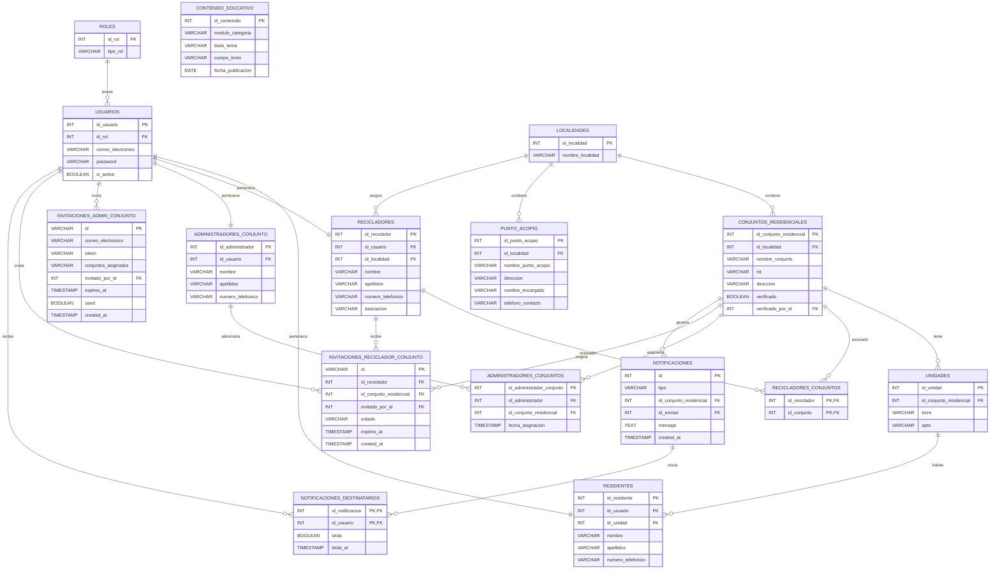

# Sistema de Gestión de Reciclaje para Conjuntos Residenciales


El sistema permite:

* Administrar usuarios y roles.
* Gestionar residentes.
* Gestionar recicladores asociados.
* Registrar conjuntos residenciales y sus unidades.
* Administrar puntos de acopio.
* Publicar contenido educativo sobre reciclaje.

---

# Tecnologías Utilizadas

| Categoría            | Tecnología   |
| -------------------- | ------------ |
| Frontend             | React        |
| Lenguaje Frontend    | TypeScript   |
| Build Tool           | Vite         |
| Estilos              | Tailwind CSS |
| Backend              | FastAPI      |
| Lenguaje Backend     | Python       |
| Base de Datos        | PostgreSQL   |
| Control de Versiones | Git          |
| Repositorio          | GitHub       |

---

# Modelo Entidad Relación



---

# Arquitectura General

```text
ROLES
   │
   ▼
USUARIOS
   │
   ├── RESIDENTES
   ├── RECICLADORES
   └── ADMINISTRADORES_CONJUNTO
              │
              ▼
       ADMINISTRADORES_CONJUNTOS ── CONJUNTOS_RESIDENCIALES

LOCALIDADES
   │
   ├── CONJUNTOS_RESIDENCIALES
   │          │
   │          ▼
   │      UNIDADES
   │          │
   │          ▼
   │     RESIDENTES
   │
   ├── PUNTO_ACOPIO
   │
   └── RECICLADORES

RECICLADORES
      ▲
      │
      ▼
RECICLADORES_CONJUNTOS
      ▲
      │
      ▼
CONJUNTOS_RESIDENCIALES

USUARIOS ── INVITACIONES_ADMIN_CONJUNTO
RECICLADORES + CONJUNTOS_RESIDENCIALES ── INVITACIONES_RECICLADOR_CONJUNTO

CONJUNTOS_RESIDENCIALES
   │
   ▼
NOTIFICACIONES
   │
   ▼
NOTIFICACIONES_DESTINATARIOS ── USUARIOS

CONTENIDO_EDUCATIVO
```

---

# Diccionario de Datos

## roles

| Campo    | Tipo    |
| -------- | ------- |
| id_rol   | INT     |
| tipo_rol | VARCHAR |

---

## usuarios

| Campo              | Tipo    |
| ------------------ | ------- |
| id_usuario         | INT     |
| id_rol             | INT     |
| correo_electronico | VARCHAR |
| password           | VARCHAR |
| is_active          | BOOLEAN |

---

## residentes

| Campo             | Tipo    |
| ----------------- | ------- |
| id_residente      | INT     |
| id_usuario        | INT     |
| id_unidad         | INT     |
| nombre            | VARCHAR |
| apellidos         | VARCHAR |
| numero_telefonico | VARCHAR |

---

## recicladores

| Campo             | Tipo    |
| ----------------- | ------- |
| id_reciclador     | INT     |
| id_usuario        | INT     |
| id_localidad      | INT     |
| nombre            | VARCHAR |
| apellidos         | VARCHAR |
| numero_telefonico | VARCHAR |
| asociacion        | VARCHAR |

---

## administradores_conjunto

| Campo             | Tipo    |
| ----------------- | ------- |
| id_administrador  | INT     |
| id_usuario        | INT     |
| nombre            | VARCHAR |
| apellidos         | VARCHAR |
| numero_telefonico | VARCHAR |

---

## localidades

| Campo            | Tipo    |
| ---------------- | ------- |
| id_localidad     | INT     |
| nombre_localidad | VARCHAR |

---

## conjuntos_residenciales

| Campo                   | Tipo    |
| ----------------------- | ------- |
| id_conjunto_residencial | INT     |
| id_localidad            | INT     |
| nombre_conjunto         | VARCHAR |
| nit                     | VARCHAR |
| direccion               | VARCHAR |
| verificado              | BOOLEAN |
| verificado_por_id       | INT     |

---

## unidades

| Campo                   | Tipo    |
| ----------------------- | ------- |
| id_unidad               | INT     |
| id_conjunto_residencial | INT     |
| torre                   | VARCHAR |
| apto                    | VARCHAR |

---

## punto_acopio

| Campo               | Tipo    |
| ------------------- | ------- |
| id_punto_acopio     | INT     |
| id_localidad        | INT     |
| nombre_punto_acopio | VARCHAR |
| direccion           | VARCHAR |
| nombre_encargado    | VARCHAR |
| telefono_contacto   | VARCHAR |

---

## contenido_educativo

| Campo             | Tipo    |
| ----------------- | ------- |
| id_contenido      | INT     |
| modulo_categoria  | VARCHAR |
| titulo_tema       | VARCHAR |
| cuerpo_texto      | VARCHAR |
| fecha_publicacion | DATE    |

---

## recicladores_conjuntos

| Campo         | Tipo |
| ------------- | ---- |
| id_reciclador | INT  |
| id_conjunto   | INT  |

**Clave primaria compuesta:**

```sql
PRIMARY KEY (id_reciclador, id_conjunto)
```

---

## administradores_conjuntos

| Campo                     | Tipo      |
| -------------------------- | --------- |
| id_administrador_conjunto | INT       |
| id_administrador          | INT       |
| id_conjunto_residencial   | INT       |
| fecha_asignacion          | TIMESTAMP |

---

## invitaciones_admin_conjunto

| Campo              | Tipo      |
| -------------------- | --------- |
| id                  | VARCHAR   |
| correo_electronico  | VARCHAR   |
| token               | VARCHAR   |
| conjuntos_asignados | VARCHAR   |
| invitado_por_id     | INT       |
| expires_at          | TIMESTAMP |
| used                | BOOLEAN   |
| created_at          | TIMESTAMP |

---

## invitaciones_reciclador_conjunto

| Campo                  | Tipo      |
| ------------------------ | --------- |
| id                      | VARCHAR   |
| id_reciclador           | INT       |
| id_conjunto_residencial | INT       |
| invitado_por_id         | INT       |
| estado                  | VARCHAR   |
| expires_at              | TIMESTAMP |
| created_at              | TIMESTAMP |

---

## notificaciones

| Campo                  | Tipo      |
| ------------------------ | --------- |
| id                      | INT       |
| tipo                    | VARCHAR   |
| id_conjunto_residencial | INT       |
| id_emisor               | INT       |
| mensaje                 | TEXT      |
| created_at              | TIMESTAMP |

---

## notificaciones_destinatarios

| Campo           | Tipo      |
| ----------------- | --------- |
| id_notificacion | INT       |
| id_usuario      | INT       |
| leida           | BOOLEAN   |
| leida_at        | TIMESTAMP |

**Clave primaria compuesta:**

```sql
PRIMARY KEY (id_notificacion, id_usuario)
```

---

# Relaciones

| Entidad A                    | Entidad B                       | Cardinalidad |
| ------------------------------ | --------------------------------- | ------------ |
| Roles                          | Usuarios                         | 1:N          |
| Usuarios                       | Residentes                       | 1:1          |
| Usuarios                       | Recicladores                     | 1:1          |
| Usuarios                       | Administradores de Conjunto      | 1:1          |
| Localidades                    | Conjuntos Residenciales          | 1:N          |
| Localidades                    | Puntos de Acopio                 | 1:N          |
| Localidades                    | Recicladores                     | 1:N          |
| Conjuntos Residenciales        | Unidades                         | 1:N          |
| Unidades                       | Residentes                       | 1:N          |
| Recicladores                   | Conjuntos Residenciales          | N:M (vía `recicladores_conjuntos`) |
| Administradores de Conjunto    | Conjuntos Residenciales          | N:M (vía `administradores_conjuntos`) |
| Usuarios                       | Invitaciones Admin Conjunto      | 1:N          |
| Recicladores                   | Invitaciones Reciclador Conjunto | 1:N          |
| Conjuntos Residenciales        | Invitaciones Reciclador Conjunto | 1:N          |
| Conjuntos Residenciales        | Notificaciones                   | 1:N          |
| Notificaciones                 | Notificaciones Destinatarios     | 1:N          |
| Usuarios                       | Notificaciones Destinatarios     | 1:N          |

---

# Reglas de Negocio

* Todo usuario debe tener un rol asignado.
* Un residente pertenece a una única unidad residencial.
* Un conjunto residencial puede contener múltiples unidades.
* Una localidad puede contener múltiples conjuntos residenciales.
* Una localidad puede contener múltiples puntos de acopio.
* Un reciclador puede estar asociado a varios conjuntos residenciales, y opcionalmente pertenecer a una localidad.
* Un conjunto residencial puede trabajar con varios recicladores.
* Un conjunto residencial solo es visible públicamente si `verificado = true`; queda registrado qué usuario lo verificó (`verificado_por_id`).
* Un Administrador de Conjunto puede administrar varios conjuntos, y un conjunto puede tener más de un administrador asignado a lo largo del tiempo.
* La cuenta de Administrador de Conjunto nunca se crea por registro público: solo se origina desde una `invitacion_admin_conjunto` emitida por un Admin_sistema, con token de un solo uso y fecha de expiración.
* Un Reciclador solo puede trabajar en un conjunto tras aceptar una `invitacion_reciclador_conjunto` emitida por el Admin_conjunto de ese conjunto.
* Las notificaciones (llegada del reciclador, SHUT lleno/vaciado) se generan una sola vez por evento y se reparten a varios destinatarios, cada uno con su propio estado de lectura.
* El contenido educativo puede ser consultado por los usuarios del sistema.
