# Sistema de Gestión de Reciclaje para Conjuntos Residenciales

> **Nota (2026-09-08)**: este diagrama estaba muy desactualizado — solo documentaba 16 de las 22 tablas reales (le faltaban `auditorias_conjunto`, `comunicados`, `novedades`, `solicitudes_desvinculacion`, `password_reset_tokens`, `email_verification_tokens`, `tokens_revocados`), y todos los IDs seguían marcados como `INT` desde antes de cualquier migración a UUID. Se reconstruyó leyendo directamente `be/app/models/*.py`, mismo criterio que ya se había aplicado en `diagrama-clases.md` el 28 de agosto.

El sistema permite:

* Administrar usuarios y roles (Administrador del Sistema, Administrador de Conjunto, Reciclador, Residente).
* Gestionar residentes y sus unidades dentro de un conjunto.
* Gestionar recicladores y su autorización — con historial — en uno o varios conjuntos.
* Registrar conjuntos residenciales verificados y sus unidades.
* Administrar puntos de acopio (ECA) por localidad.
* Publicar contenido educativo, comunicados de conjunto y novedades generales.
* Coordinar notificaciones automáticas (llegada del reciclador, SHUT lleno/vaciado) y auditorías de desempeño.

---

# Tecnologías Utilizadas

| Categoría            | Tecnología   |
| --------------------- | ------------ |
| Frontend             | React        |
| Lenguaje Frontend    | TypeScript   |
| Build Tool           | Vite         |
| Estilos              | Tailwind CSS |
| Backend              | FastAPI      |
| Lenguaje Backend     | Python       |
| Base de Datos        | PostgreSQL   |
| Control de Versiones | Git          |
| Repositorio          | GitHub       |

---

# Modelo Entidad Relación

```mermaid
erDiagram

    ROLES {
        INT id_rol PK
        VARCHAR tipo_rol
    }

    LOCALIDADES {
        INT id_localidad PK
        VARCHAR nombre_localidad
    }

    USUARIOS {
        UUID id_usuario PK
        INT id_rol FK
        VARCHAR correo_electronico
        VARCHAR password
        BOOLEAN is_active
        BOOLEAN habilitado
        VARCHAR locale
        INT intentos_fallidos
        TIMESTAMP bloqueado_hasta
        VARCHAR foto_perfil_url
    }

    RESIDENTES {
        UUID id_residente PK
        UUID id_usuario FK
        UUID id_unidad FK
        VARCHAR nombre
        VARCHAR apellidos
        VARCHAR numero_telefonico
    }

    RECICLADORES {
        UUID id_reciclador PK
        UUID id_usuario FK
        INT localidad_id FK
        VARCHAR nombre
        VARCHAR apellidos
        VARCHAR asociacion
        VARCHAR numero_telefonico
        BOOLEAN mostrar_contacto_directorio
    }

    ADMINISTRADORES_CONJUNTO {
        UUID id_administrador PK
        UUID id_usuario FK
        VARCHAR nombre
        VARCHAR apellidos
        VARCHAR numero_telefonico
    }

    CONJUNTOS_RESIDENCIALES {
        UUID id_conjunto_residencial PK
        INT id_localidad FK
        VARCHAR nombre_conjunto
        VARCHAR nit
        VARCHAR direccion
        BOOLEAN verificado
        UUID verificado_por_id FK
        VARCHAR codigo_acceso
    }

    UNIDADES {
        UUID id_unidad PK
        UUID id_conjunto_residencial FK
        VARCHAR torre
        VARCHAR apto
    }

    PUNTOS_ACOPIOS {
        UUID id_punto_acopio PK
        INT id_localidad FK
        VARCHAR nombre
        VARCHAR nombre_encargado
        VARCHAR direccion
        VARCHAR telefono_contacto
        BOOLEAN activo
    }

    CONTENIDO_EDUCATIVO {
        UUID id_contenido PK
        VARCHAR modulo_categoria
        VARCHAR titulo_tema
        TEXT cuerpo_texto
        DATE fecha_publicacion
        VARCHAR url_video
        VARCHAR url_guia
    }

    RECICLADORES_CONJUNTOS {
        UUID id PK
        UUID id_reciclador FK
        UUID id_conjunto_residencial FK
        TIMESTAMP fecha_autorizacion
        TIMESTAMP fecha_revocacion
        UUID revocado_por_id FK
    }

    ADMINISTRADORES_CONJUNTOS {
        UUID id_administrador_conjunto PK
        UUID id_administrador FK
        UUID id_conjunto_residencial FK
        TIMESTAMP fecha_asignacion
        TIMESTAMP fecha_desvinculacion
    }

    INVITACIONES_ADMIN_CONJUNTO {
        UUID id PK
        VARCHAR correo_electronico
        VARCHAR token
        TEXT conjuntos_asignados
        UUID invitado_por_id FK
        TIMESTAMP expires_at
        BOOLEAN used
        TIMESTAMP created_at
    }

    INVITACIONES_RECICLADOR_CONJUNTO {
        UUID id PK
        UUID id_reciclador FK
        UUID id_conjunto_residencial FK
        UUID invitado_por_id FK
        VARCHAR estado
        TIMESTAMP expires_at
        TIMESTAMP created_at
    }

    SOLICITUDES_DESVINCULACION {
        UUID id PK
        UUID id_administrador FK
        UUID id_conjunto_residencial FK
        TEXT motivo
        VARCHAR estado
        TEXT motivo_rechazo
        TIMESTAMP created_at
        TIMESTAMP resuelta_at
        UUID resuelta_por_id FK
    }

    COMUNICADOS {
        UUID id_comunicado PK
        UUID id_conjunto_residencial FK
        UUID id_administrador FK
        VARCHAR destinatarios
        VARCHAR tipo
        TEXT texto
        VARCHAR url_adjunto
        DATE fecha_evento
        TIMESTAMP fecha_expiracion
        TIMESTAMP created_at
        TIMESTAMP fecha_edicion
    }

    NOVEDADES {
        UUID id_novedad PK
        UUID id_admin_sistema FK
        VARCHAR alcance
        TEXT texto
        VARCHAR url_adjunto
        TIMESTAMP fecha_expiracion
        TIMESTAMP created_at
        TIMESTAMP fecha_edicion
        TIMESTAMP fecha_archivado
    }

    NOTIFICACIONES {
        UUID id PK
        VARCHAR tipo
        UUID id_conjunto_residencial FK
        UUID id_emisor FK
        TEXT mensaje
        UUID id_referencia
        TIMESTAMP created_at
    }

    NOTIFICACIONES_DESTINATARIOS {
        UUID id_notificacion PK,FK
        UUID id_usuario PK,FK
        BOOLEAN leida
        TIMESTAMP leida_at
    }

    AUDITORIAS_CONJUNTO {
        UUID id_auditoria PK
        UUID id_reciclador FK
        UUID id_conjunto_residencial FK
        VARCHAR nivel_desempeno
        VARCHAR tema_educativo
        TEXT descripcion
        VARCHAR ruta_evidencia
        VARCHAR ruta_evidencia_2
        VARCHAR ruta_evidencia_3
        TIMESTAMP created_at
        BIGINT orden_interno
    }

    PASSWORD_RESET_TOKENS {
        UUID id PK
        UUID id_usuario FK
        VARCHAR token
        TIMESTAMP expires_at
        BOOLEAN used
        TIMESTAMP created_at
    }

    EMAIL_VERIFICATION_TOKENS {
        UUID id PK
        UUID id_usuario FK
        VARCHAR token
        TIMESTAMP expires_at
        BOOLEAN used
        TIMESTAMP created_at
    }

    TOKENS_REVOCADOS {
        UUID jti PK
        TIMESTAMP expira_en
    }

    ROLES ||--o{ USUARIOS : posee

    USUARIOS ||--|| RESIDENTES : pertenece
    USUARIOS ||--|| RECICLADORES : pertenece
    USUARIOS ||--|| ADMINISTRADORES_CONJUNTO : pertenece
    USUARIOS ||--o{ PASSWORD_RESET_TOKENS : solicita
    USUARIOS ||--o{ EMAIL_VERIFICATION_TOKENS : solicita
    USUARIOS ||--o{ INVITACIONES_ADMIN_CONJUNTO : invita
    USUARIOS ||--o{ SOLICITUDES_DESVINCULACION : resuelve
    USUARIOS ||--o{ NOVEDADES : publica
    USUARIOS ||--o{ NOTIFICACIONES : emite
    USUARIOS ||--o{ NOTIFICACIONES_DESTINATARIOS : recibe
    USUARIOS ||--o{ CONJUNTOS_RESIDENCIALES : verifica
    USUARIOS ||--o{ RECICLADORES_CONJUNTOS : revoca

    LOCALIDADES ||--o{ CONJUNTOS_RESIDENCIALES : contiene
    LOCALIDADES ||--o{ PUNTOS_ACOPIOS : contiene
    LOCALIDADES ||--o{ RECICLADORES : ubica

    CONJUNTOS_RESIDENCIALES ||--o{ UNIDADES : tiene
    UNIDADES ||--o{ RESIDENTES : habita

    RECICLADORES ||--o{ RECICLADORES_CONJUNTOS : autoriza
    CONJUNTOS_RESIDENCIALES ||--o{ RECICLADORES_CONJUNTOS : asocia

    RECICLADORES ||--o{ AUDITORIAS_CONJUNTO : registra
    CONJUNTOS_RESIDENCIALES ||--o{ AUDITORIAS_CONJUNTO : recibe

    ADMINISTRADORES_CONJUNTO ||--o{ ADMINISTRADORES_CONJUNTOS : administra
    CONJUNTOS_RESIDENCIALES ||--o{ ADMINISTRADORES_CONJUNTOS : asignado

    ADMINISTRADORES_CONJUNTO ||--o{ SOLICITUDES_DESVINCULACION : solicita
    CONJUNTOS_RESIDENCIALES ||--o{ SOLICITUDES_DESVINCULACION : origina

    ADMINISTRADORES_CONJUNTO ||--o{ COMUNICADOS : publica
    CONJUNTOS_RESIDENCIALES ||--o{ COMUNICADOS : recibe

    RECICLADORES ||--o{ INVITACIONES_RECICLADOR_CONJUNTO : recibe
    CONJUNTOS_RESIDENCIALES ||--o{ INVITACIONES_RECICLADOR_CONJUNTO : origina

    CONJUNTOS_RESIDENCIALES ||--o{ NOTIFICACIONES : genera
    NOTIFICACIONES ||--o{ NOTIFICACIONES_DESTINATARIOS : envia
```



---

# Arquitectura General

```text
ROLES
   │
   ▼
USUARIOS ── PASSWORD_RESET_TOKENS / EMAIL_VERIFICATION_TOKENS
   │
   ├── RESIDENTES
   ├── RECICLADORES
   └── ADMINISTRADORES_CONJUNTO
              │
              ├── ADMINISTRADORES_CONJUNTOS ── CONJUNTOS_RESIDENCIALES
              ├── SOLICITUDES_DESVINCULACION ── CONJUNTOS_RESIDENCIALES
              └── COMUNICADOS ── CONJUNTOS_RESIDENCIALES

LOCALIDADES
   │
   ├── CONJUNTOS_RESIDENCIALES
   │          │
   │          ▼
   │      UNIDADES
   │          │
   │          ▼
   │     RESIDENTES
   │
   ├── PUNTOS_ACOPIOS
   │
   └── RECICLADORES

RECICLADORES
      ▲
      │
      ▼
RECICLADORES_CONJUNTOS  (con historial: fecha_autorizacion / fecha_revocacion / revocado_por_id)
      ▲
      │
      ▼
CONJUNTOS_RESIDENCIALES ── AUDITORIAS_CONJUNTO ── RECICLADORES

USUARIOS ── INVITACIONES_ADMIN_CONJUNTO
RECICLADORES + CONJUNTOS_RESIDENCIALES ── INVITACIONES_RECICLADOR_CONJUNTO

CONJUNTOS_RESIDENCIALES
   │
   ▼
NOTIFICACIONES
   │
   ▼
NOTIFICACIONES_DESTINATARIOS ── USUARIOS

USUARIOS (Admin_sistema) ── NOVEDADES

TOKENS_REVOCADOS  (lista negra de JWT, sin relación a otras tablas)

CONTENIDO_EDUCATIVO  (catálogo independiente, sin relación a otras tablas)
```

---

# Diccionario de Datos

## roles

| Campo    | Tipo    |
| -------- | ------- |
| id_rol   | INT     |
| tipo_rol | VARCHAR |

---

## localidades

| Campo            | Tipo    |
| ---------------- | ------- |
| id_localidad     | INT     |
| nombre_localidad | VARCHAR |

---

## usuarios

| Campo              | Tipo      |
| ------------------ | --------- |
| id_usuario         | UUID      |
| id_rol             | INT       |
| correo_electronico | VARCHAR   |
| password           | VARCHAR   |
| is_active          | BOOLEAN   |
| habilitado         | BOOLEAN   |
| locale             | VARCHAR   |
| intentos_fallidos  | INT       |
| bloqueado_hasta    | TIMESTAMP |
| foto_perfil_url    | VARCHAR   |

`is_active` refleja si el correo ya fue verificado al registrarse; `habilitado` es un interruptor manual aparte, que solo el Admin Sistema puede apagar (RQF: gestión de usuarios). Una cuenta puede tener `is_active = true` y `habilitado = false` — no puede iniciar sesión de todas formas.

---

## residentes

| Campo             | Tipo    |
| ----------------- | ------- |
| id_residente      | UUID    |
| id_usuario        | UUID    |
| id_unidad         | UUID    |
| nombre            | VARCHAR |
| apellidos         | VARCHAR |
| numero_telefonico | VARCHAR |

---

## recicladores

| Campo                       | Tipo    |
| ---------------------------- | ------- |
| id_reciclador                | UUID    |
| id_usuario                   | UUID    |
| localidad_id                 | INT     |
| nombre                       | VARCHAR |
| apellidos                    | VARCHAR |
| asociacion                   | VARCHAR |
| numero_telefonico            | VARCHAR |
| mostrar_contacto_directorio  | BOOLEAN |

`localidad_id` es opcional (`NULL` permitido) — un reciclador puede no tener localidad asignada. `mostrar_contacto_directorio` controla si su teléfono se expone en el Directorio (privacidad, apagado por defecto).

---

## administradores_conjunto

| Campo             | Tipo    |
| ----------------- | ------- |
| id_administrador  | UUID    |
| id_usuario        | UUID    |
| nombre            | VARCHAR |
| apellidos         | VARCHAR |
| numero_telefonico | VARCHAR |

---

## conjuntos_residenciales

| Campo                   | Tipo    |
| ----------------------- | ------- |
| id_conjunto_residencial | UUID    |
| id_localidad            | INT     |
| nombre_conjunto         | VARCHAR |
| nit                     | VARCHAR |
| direccion               | VARCHAR |
| verificado              | BOOLEAN |
| verificado_por_id       | UUID    |
| codigo_acceso           | VARCHAR |

`codigo_acceso` es único por conjunto — el Admin de Conjunto lo reparte fuera de la app para que un Residente demuestre que vive ahí al registrarse.

---

## unidades

| Campo                   | Tipo    |
| ----------------------- | ------- |
| id_unidad               | UUID    |
| id_conjunto_residencial | UUID    |
| torre                   | VARCHAR |
| apto                    | VARCHAR |

---

## puntos_acopios

| Campo             | Tipo    |
| ----------------- | ------- |
| id_punto_acopio   | UUID    |
| id_localidad      | INT     |
| nombre            | VARCHAR |
| nombre_encargado  | VARCHAR |
| direccion         | VARCHAR |
| telefono_contacto | VARCHAR |
| activo            | BOOLEAN |

`activo` es un soft-delete (HU-017): un punto dado de baja no se borra, solo deja de verse en el directorio público hasta reactivarse.

---

## contenido_educativo

| Campo             | Tipo    |
| ----------------- | ------- |
| id_contenido      | UUID    |
| modulo_categoria  | VARCHAR |
| titulo_tema       | VARCHAR |
| cuerpo_texto      | TEXT    |
| fecha_publicacion | DATE    |
| url_video         | VARCHAR |
| url_guia          | VARCHAR |

`cuerpo_texto` admite Markdown, renderizado en el frontend. `url_guia` puede ser un archivo subido (PDF/imagen) o un link externo.

---

## recicladores_conjuntos

| Campo                   | Tipo      |
| ------------------------ | --------- |
| id                      | UUID      |
| id_reciclador           | UUID      |
| id_conjunto_residencial | UUID      |
| fecha_autorizacion      | TIMESTAMP |
| fecha_revocacion        | TIMESTAMP |
| revocado_por_id         | UUID      |

Tabla de asociación **con historial** (HU-038) — no es una tabla puente simple. `fecha_revocacion` queda `NULL` mientras el acceso está activo; se llena al revocarse, junto con `revocado_por_id`. Un índice único parcial garantiza solo **una** autorización activa por pareja (reciclador, conjunto) a la vez.

---

## administradores_conjuntos

| Campo                     | Tipo      |
| -------------------------- | --------- |
| id_administrador_conjunto | UUID      |
| id_administrador          | UUID      |
| id_conjunto_residencial   | UUID      |
| fecha_asignacion          | TIMESTAMP |
| fecha_desvinculacion      | TIMESTAMP |

Mismo patrón que `recicladores_conjuntos` — historial de asignación/desvinculación, no una tabla puente simple. Índice único parcial: solo un administrador activo por conjunto a la vez.

---

## invitaciones_admin_conjunto

| Campo                | Tipo      |
| --------------------- | --------- |
| id                    | UUID      |
| correo_electronico    | VARCHAR   |
| token                 | VARCHAR   |
| conjuntos_asignados   | TEXT      |
| invitado_por_id       | UUID      |
| expires_at            | TIMESTAMP |
| used                  | BOOLEAN   |
| created_at            | TIMESTAMP |

---

## invitaciones_reciclador_conjunto

| Campo                    | Tipo      |
| ------------------------- | --------- |
| id                        | UUID      |
| id_reciclador             | UUID      |
| id_conjunto_residencial   | UUID      |
| invitado_por_id           | UUID      |
| estado                    | VARCHAR   |
| expires_at                | TIMESTAMP |
| created_at                | TIMESTAMP |

`estado` puede ser `PENDIENTE`, `ACEPTADA` o `RECHAZADA`. Al aceptarse, se crea la fila correspondiente en `recicladores_conjuntos`.

---

## solicitudes_desvinculacion

| Campo                    | Tipo      |
| ------------------------- | --------- |
| id                        | UUID      |
| id_administrador          | UUID      |
| id_conjunto_residencial   | UUID      |
| motivo                    | TEXT      |
| estado                    | VARCHAR   |
| motivo_rechazo            | TEXT      |
| created_at                | TIMESTAMP |
| resuelta_at                | TIMESTAMP |
| resuelta_por_id            | UUID      |

Solicitud de un Admin de Conjunto para dejar de administrar un conjunto (RQF-016) — requiere aprobación del Admin Sistema. Índice único parcial: solo una solicitud `PENDIENTE` a la vez por (administrador, conjunto).

---

## comunicados

| Campo                    | Tipo      |
| ------------------------- | --------- |
| id_comunicado             | UUID      |
| id_conjunto_residencial   | UUID      |
| id_administrador          | UUID      |
| destinatarios             | VARCHAR   |
| tipo                      | VARCHAR   |
| texto                     | TEXT      |
| url_adjunto               | VARCHAR   |
| fecha_evento              | DATE      |
| fecha_expiracion          | TIMESTAMP |
| created_at                | TIMESTAMP |
| fecha_edicion             | TIMESTAMP |

Avisos que un Admin de Conjunto publica para los residentes y/o recicladores de **su** conjunto (RQF-014). `destinatarios` distingue a quién va dirigido (residentes, recicladores o ambos). `url_adjunto` acepta imagen, PDF o documento de Office.

---

## novedades

| Campo             | Tipo      |
| ------------------ | --------- |
| id_novedad         | UUID      |
| id_admin_sistema   | UUID      |
| alcance            | VARCHAR   |
| texto              | TEXT      |
| url_adjunto        | VARCHAR   |
| fecha_expiracion   | TIMESTAMP |
| created_at         | TIMESTAMP |
| fecha_edicion      | TIMESTAMP |
| fecha_archivado    | TIMESTAMP |

Avisos de alcance general que el Admin Sistema publica (RQF-015), no ligados a un conjunto — `alcance` decide si va a todos los usuarios o a un rol concreto. Puede archivarse manualmente antes de expirar.

---

## notificaciones

| Campo                    | Tipo      |
| ------------------------- | --------- |
| id                        | UUID      |
| tipo                      | VARCHAR   |
| id_conjunto_residencial   | UUID      |
| id_emisor                 | UUID      |
| mensaje                   | TEXT      |
| id_referencia             | UUID      |
| created_at                | TIMESTAMP |

Avisos automáticos del sistema (llegada del reciclador, SHUT lleno/vaciado, revocación de acceso). `id_referencia` apunta opcionalmente a la entidad que originó la notificación.

---

## notificaciones_destinatarios

| Campo           | Tipo      |
| ----------------- | --------- |
| id_notificacion | UUID      |
| id_usuario      | UUID      |
| leida           | BOOLEAN   |
| leida_at        | TIMESTAMP |

**Clave primaria compuesta:**

```sql
PRIMARY KEY (id_notificacion, id_usuario)
```

`notificaciones` guarda el evento una sola vez; esta tabla registra, por cada destinatario, si ya lo leyó.

---

## auditorias_conjunto

| Campo                    | Tipo      |
| ------------------------- | --------- |
| id_auditoria              | UUID      |
| id_reciclador              | UUID      |
| id_conjunto_residencial    | UUID      |
| nivel_desempeno            | VARCHAR   |
| tema_educativo             | VARCHAR   |
| descripcion                | TEXT      |
| ruta_evidencia              | VARCHAR   |
| ruta_evidencia_2            | VARCHAR   |
| ruta_evidencia_3            | VARCHAR   |
| created_at                  | TIMESTAMP |
| orden_interno                | BIGINT    |

Calificación de desempeño que un Reciclador registra tras visitar un conjunto (RQF-009/RQF-013). Solo `ruta_evidencia` es obligatoria; las otras 2 fotos son opcionales. `orden_interno` es un contador autoincremental aparte del `id` (UUID, no ordenable) para mostrar el historial en el orden real en que ocurrió.

---

## password_reset_tokens / email_verification_tokens

| Campo       | Tipo      |
| ----------- | --------- |
| id          | UUID      |
| id_usuario  | UUID      |
| token       | VARCHAR   |
| expires_at  | TIMESTAMP |
| used        | BOOLEAN   |
| created_at  | TIMESTAMP |

Estructura idéntica entre ambas tablas — tokens de un solo uso, con expiración (1 hora para recuperar contraseña, 24 horas para verificar correo).

---

## tokens_revocados

| Campo      | Tipo      |
| ---------- | --------- |
| jti        | UUID      |
| expira_en  | TIMESTAMP |

Lista negra de tokens JWT invalidados por un logout real (HU-008/RQF-007). `jti` no se genera con `generar_uuid4()` propio — viene ya incluido dentro del JWT. Es la única tabla sin ninguna relación hacia otra.

---

# Relaciones

| Entidad A                    | Entidad B                       | Cardinalidad |
| ------------------------------ | --------------------------------- | ------------ |
| Roles                          | Usuarios                         | 1:N          |
| Usuarios                       | Residentes                       | 1:1          |
| Usuarios                       | Recicladores                     | 1:1          |
| Usuarios                       | Administradores de Conjunto      | 1:1          |
| Usuarios                       | Password Reset Tokens            | 1:N          |
| Usuarios                       | Email Verification Tokens        | 1:N          |
| Usuarios                       | Invitaciones Admin Conjunto      | 1:N (invita) |
| Usuarios                       | Solicitudes Desvinculación       | 1:N (resuelve) |
| Usuarios                       | Novedades                        | 1:N (publica) |
| Usuarios                       | Notificaciones                   | 1:N (emite) |
| Usuarios                       | Notificaciones Destinatarios     | 1:N          |
| Usuarios                       | Conjuntos Residenciales          | 1:N (verifica) |
| Usuarios                       | Recicladores Conjuntos           | 1:N (revoca) |
| Localidades                    | Conjuntos Residenciales          | 1:N          |
| Localidades                    | Puntos de Acopio                 | 1:N          |
| Localidades                    | Recicladores                     | 1:N          |
| Conjuntos Residenciales        | Unidades                         | 1:N          |
| Unidades                       | Residentes                       | 1:N          |
| Recicladores                   | Recicladores Conjuntos           | 1:N          |
| Conjuntos Residenciales        | Recicladores Conjuntos           | 1:N          |
| Recicladores                   | Auditorías de Conjunto           | 1:N          |
| Conjuntos Residenciales        | Auditorías de Conjunto           | 1:N          |
| Administradores de Conjunto    | Administradores Conjuntos        | 1:N          |
| Conjuntos Residenciales        | Administradores Conjuntos        | 1:N          |
| Administradores de Conjunto    | Solicitudes Desvinculación       | 1:N          |
| Conjuntos Residenciales        | Solicitudes Desvinculación       | 1:N          |
| Administradores de Conjunto    | Comunicados                      | 1:N          |
| Conjuntos Residenciales        | Comunicados                      | 1:N          |
| Recicladores                   | Invitaciones Reciclador Conjunto | 1:N          |
| Conjuntos Residenciales        | Invitaciones Reciclador Conjunto | 1:N          |
| Conjuntos Residenciales        | Notificaciones                   | 1:N          |
| Notificaciones                 | Notificaciones Destinatarios     | 1:N          |

---

# Reglas de Negocio

* Todo usuario debe tener un rol asignado.
* Una cuenta con `habilitado = false` (desactivada por el Admin Sistema) no puede iniciar sesión ni renovar su token, sin importar el valor de `is_active`.
* Un residente pertenece a una única unidad residencial, y se registra únicamente aportando el `codigo_acceso` real de su conjunto.
* Un conjunto residencial puede contener múltiples unidades.
* Un conjunto residencial solo es visible públicamente si `verificado = true`; queda registrado qué usuario lo verificó (`verificado_por_id`).
* Una localidad puede contener múltiples conjuntos residenciales, puntos de acopio y recicladores.
* Un punto de acopio dado de baja (`activo = false`) no se borra — solo deja de verse en el directorio público hasta reactivarse.
* Un reciclador puede estar autorizado en varios conjuntos residenciales a la vez, y opcionalmente pertenecer a una localidad. La autorización queda registrada con historial (`recicladores_conjuntos`): solo puede haber **una** activa por pareja (reciclador, conjunto) en un momento dado, pero pueden existir varias históricas (revocadas) para la misma pareja.
* Un Admin de Conjunto puede revocar el acceso de un reciclador que ya autorizó — el vínculo no se borra, queda marcado con `fecha_revocacion` y `revocado_por_id`, y el reciclador recibe una notificación.
* Un Administrador de Conjunto puede administrar varios conjuntos, y un conjunto puede tener más de un administrador asignado a lo largo del tiempo (uno activo, otros históricos).
* La cuenta de Administrador de Conjunto nunca se crea por registro público: solo se origina desde una `invitacion_admin_conjunto` emitida por un Admin Sistema, con token de un solo uso y fecha de expiración.
* Un Reciclador solo puede trabajar en un conjunto tras aceptar una `invitacion_reciclador_conjunto` emitida por el Admin de Conjunto de ese conjunto.
* Un Admin de Conjunto puede solicitar dejar de administrar un conjunto (`solicitud_desvinculacion`) — requiere aprobación del Admin Sistema, y solo puede haber una solicitud `PENDIENTE` a la vez por (administrador, conjunto).
* Un Admin de Conjunto publica comunicados dirigidos a los residentes y/o recicladores de su propio conjunto; un Admin Sistema publica novedades de alcance general (todos los usuarios, o un rol específico).
* Las notificaciones (llegada del reciclador, SHUT lleno/vaciado, revocación de acceso) se generan una sola vez por evento y se reparten a varios destinatarios, cada uno con su propio estado de lectura.
* Un logout real invalida el token de sesión agregando su `jti` a `tokens_revocados` — no basta con que el frontend "olvide" el token.
* El contenido educativo puede ser consultado por los usuarios del sistema, y puede recibir texto en formato Markdown.
